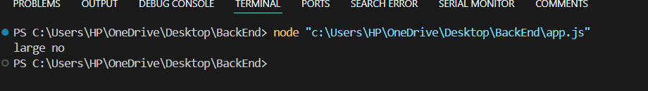

# REPL


# CLI

```
const amount = 12;

if(amount<12){
    console.log('small no');
}else{
    console.log('large no');
}

```




# Global

```

//  Globals - No Winsdow

// global is a reference to the real global scope object in NodeJS,
//  somewhat like using window in a browser JS environment

console.log(__dirname);

setInterval(()=>{
  console.log("Hello World");
}, 1000)

```

# Modules

 `name.js`

```
const john ="John";
const peter = "Petere"
const secret = "Super Key"

module.exports = {john, peter}

```
`utils.js`

```
const sayHi = (name) =>{
    console.log(`Hello there ${name}`);
}

module.exports = sayHi

```

 `app.js`

```
// common js - Every File is module
//  Modules - Encapsulated code to share only minimum

const names = require('./name')
const sayHi = require('./utils')

sayHi(names.john);

```

## 1. OS Modules

```
const os = require('os');

// Info about current user

const user = os.userInfo();
console.log(user);

// Method return the system update 
console.log(`The system up time is ${os.uptime()} seconds`);

const currentOs = {
    name: os.type(),
    release: os.release(),
    totalMem: os.totalmem(),
    freeMem: os.freemem()
}

console.log(currentOs);

```

## 2. PATH Module

```
const path = require('path');

console.log(path.sep);

const filePath = path.join('/content/', 'subfolder', 'test.txt');

console.log(filePath);

const base = path.basename(filePath)

console.log(base);

```

## 3. FS Module

`FS Sync`

```
const {readFileSync, writeFileSync} = require('fs');

const first = readFileSync('./content/first.txt', 'utf8')
const second = readFileSync('./content/second.txt', 'utf8')

console.log(first);
console.log(second);

writeFileSync('./content/result.text', 'Here is the result')

```

`FS Async`

CallBack Hell

```
const {readFile, writeFile} = require('fs');

readFile('./content/first.txt', 'utf8', (err, result) =>{
    if(err){
        console.log(err);
        return
    }
    const first = result
    readFile('./content/second.txt', 'utf8', (err, result) =>{
        if(err){
            console.log(err);
            return
        }
        const second = result;

        writeFile('./content/result2.txt', `${first} ${second}`, (err, result) =>{
            if(err){
                return
                console.log(err);
            }
            console.log(result);
        });
    
    })
})

```
### Synx Vs Async

synchronous (sync) - you can only execute one thing at a time
asynchronous (async) - you can execute multiple things at the same time

## 4. HTTP Module

```
const http = require('http');

const server = http.createServer((req, res) =>{
    res.write("Welcome");
    res.end();
})

server.listen(5000);

```

# NPM

npm - global command comes with code.  
npm --v.  

local dependency - use it only in particular project.  
`npm i package`.  

global dependency - use it in any project.  
`npm i -g package`.  

package.json - manifest file.  
`npm init -y`.  

